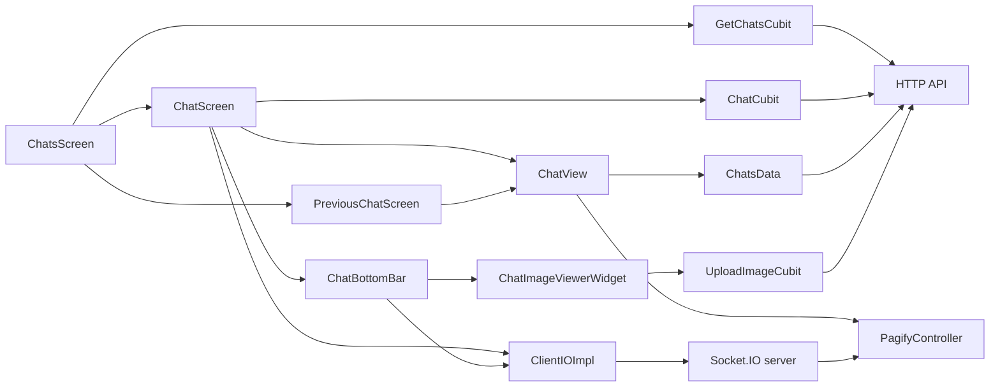
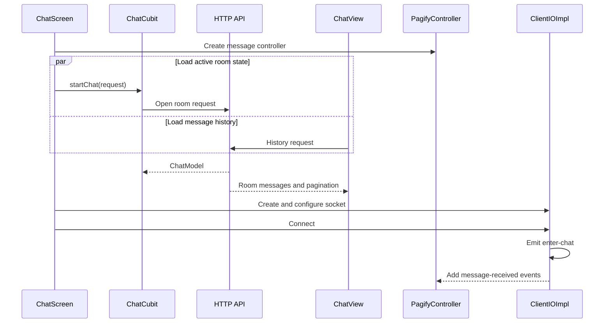
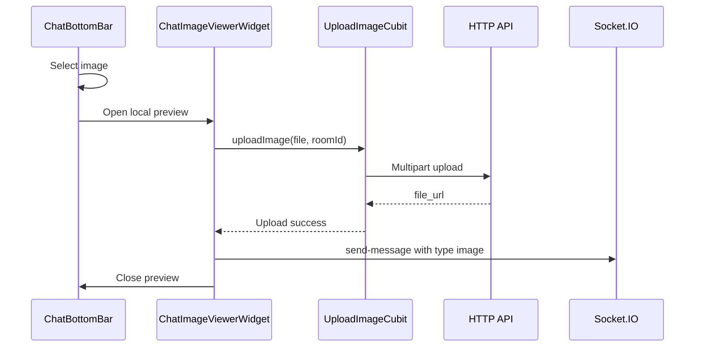

# Normal Chat Feature

## Scope

This document describes only the normal messaging functionality implemented
under `lib/src/features/chats/`:

- Chat-list loading and caching.
- Opening an interactive conversation.
- Loading paginated message history.
- Connecting to a Socket.IO room.
- Sending and receiving text messages.
- Uploading and sending image messages.
- Rendering incoming and outgoing messages.
- Resetting unread counts and marking a room as read.
- Displaying previous conversations as read-only history.

Application-specific workflows surrounding a conversation are outside this
document.

## Architecture overview

Normal chat uses HTTP and Socket.IO together:

- HTTP loads chat summaries, opens a room, loads history, uploads images, and
  marks messages as read.
- Socket.IO joins the active room and sends or receives live messages.
- Cubits expose asynchronous HTTP state.
- `PagifyController<ChatMessages>` owns the message collection rendered on the
  screen.
- Stateful widgets own short-lived UI objects such as text controllers and the
  selected image.



## Messaging-related files

```text
lib/src/features/chats/
├── NORMAL_CHAT_FEATURE.md
├── data/
│   ├── chats_data.dart
│   │   ├── Loads message history
│   │   ├── Reverses history for the chat list
│   │   └── Marks a room as read
│   ├── socket_events.dart
│   │   └── Defines message and room event names
│   └── models/
│       ├── chat_model.dart
│       │   └── Room, member, message-history, and list-summary data
│       ├── message_params_model.dart
│       │   └── Socket connection query parameters
│       └── request_model.dart
│           └── Input used to open a conversation
└── presentation/
    ├── cubits/
    │   ├── get_chats_cubit.dart
    │   │   └── Loads and caches chat summaries
    │   ├── start_chat.dart
    │   │   └── Loads the active room model
    │   └── upload_image.dart
    │       └── Uploads an image before it is sent through the socket
    ├── screens/
    │   ├── chats_screen.dart
    │   │   └── Current and previous chat lists
    │   ├── chat_screen.dart
    │   │   └── Interactive conversation lifecycle
    │   └── previous_chat_screen.dart
    │       └── Read-only message history
    └── widgets/
        ├── chat_list_tile.dart
        │   └── Converts a chat summary into navigation
        ├── chat_card.dart
        │   └── Avatar, name, preview, time, and unread badge
        ├── chat_image_viewer.dart
        │   └── Local image preview and upload action
        ├── chat_status_builder.dart
        │   └── Async-state rendering adapter
        ├── chat_unavailable_indicator.dart
        │   └── Feedback shown when composing is unavailable
        └── chat/
            ├── chat_view.dart
            │   └── History loading and Pagify configuration
            ├── message_widget.dart
            │   └── Text/image bubble rendering
            └── bottom_bar.dart
                └── Text composer and image picker

lib/src/core/
├── socket_service/
│   └── client_io.dart
│       ├── SocketHelper interface
│       └── ClientIOImpl Socket.IO adapter
└── widgets/chat_builder/
    ├── chat_message.dart
    │   └── Message, Sender, and ChatMessages entities
    ├── easy_chat.dart
    │   └── Public reusable chat-list widget
    ├── chat_body.dart
    │   └── Reversed Pagify list implementation
    └── message_widget.dart
        └── Selects the incoming or outgoing message builder
```

## Component responsibilities

| Component | Messaging responsibility |
|---|---|
| `ChatsScreen` | Selects the current or previous chat list and hosts list tabs. |
| `GetChatsCubit` | Loads chat summaries, manages cache mapping, and resets the local unread count. |
| `ChatListTile` | Creates the room-open request and navigates to an interactive or read-only screen. |
| `ChatScreen` | Creates the message controller and socket, handles lifecycle changes, sends messages, and marks the room as read. |
| `ChatCubit` | Loads the active room response into `AsyncState<ChatModel>`. |
| `ChatView` | Loads historical messages and maps them to Pagify. |
| `PagifyController` | Stores displayed messages and accepts newly received socket messages. |
| `ClientIOImpl` | Connects to Socket.IO, joins/leaves a room, emits outgoing messages, and maps incoming events. |
| `ChatBottomBar` | Owns text input, validates content, and starts image selection. |
| `UploadImageCubit` | Uploads an image and returns its server URL. |
| `ChatMessageWidget` | Renders a text or image bubble with avatar and timestamp. |
| `PreviousChatScreen` | Displays message history without creating a socket or composer. |

## Core data model

### `RequestModel`

The screen receives a `RequestModel` identifying the remote chat member and the
navigation origin:

```dart
RequestModel(
  receiverId: receiverId,
  fromHome: originFlag,
)
```

Its JSON form is:

```json
{
  "receiver_id": "...",
  "from_home": "..."
}
```

### Room and history

For normal messaging, the relevant `ChatModel` branch is `room`:

```text
ChatModel
└── Room
    ├── id: int?
    ├── members: List<Members>?
    ├── messages: Messages?
    │   ├── pagination: PaginationData?
    │   └── data: List<ChatMessages>?
    ├── lastMessageBody: String?
    ├── lastMessageCreatedDt: String?
    └── unreadMsgs: int?
```

`Members` supplies the member ID, display name, avatar, type information, and
availability flag used by the chat UI.

`Room.lastMessageBody`, `lastMessageCreatedDt`, and `unreadMsgs` are summary
fields used by `ChatCard`. The full `Messages` object is used by `ChatView`.

### Shared message entities

The transport-neutral message entities live in
`lib/src/core/widgets/chat_builder/chat_message.dart`:

```text
ChatMessages
├── message: Message
│   ├── id: int
│   ├── body: String
│   └── type: String
├── sender: Sender
│   ├── id: String
│   ├── name: String
│   ├── image: String
│   └── isFromMe: bool
├── time: String?
└── messageState: MessageState?
```

`MessageState` defines `pending`, `sent`, `delivered`, and `read`. These states
are available in the shared model but are not currently updated or displayed by
the normal chat feature.

## Message mapping

Historical and live messages use the same Dart model but different server field
names.

### HTTP history mapping

`Messages.fromJson()` maps room history as follows:

| HTTP field | Dart field |
|---|---|
| `id` | `message.id` |
| `type` | `message.type` |
| `body` | `message.body` |
| `sender_id` | `sender.id` |
| `name` | `sender.name` |
| `avatar` | `sender.image` |
| `is_sender` | `sender.isFromMe` |
| `created_at` | `time` |

### Socket message mapping

`ChatScreen` maps `message-received` data as follows:

| Socket field | Dart field |
|---|---|
| `id` | `message.id` |
| `type` | `message.type` |
| `body` | `message.body` |
| `sender_id` | `sender.id` |
| `sender_name` | `sender.name` |
| `avatar` | `sender.image` |
| Comparison with the current user ID | `sender.isFromMe` |
| `created_dt` | `time` |

The two mappings must be updated separately if either backend payload changes.

## Chat-list flow

`ChatsScreen` renders current conversations directly and previous conversations
through tabbed list filters. Each list body creates its own `GetChatsCubit` and
loads the corresponding list.

`GetChatsCubit.getChat()`:

1. Maps the selected `ChatType` to its HTTP endpoint.
2. Calls `BaseCrudUseCase` with `HttpRequestType.get`.
3. Maps the returned list into `ChatModel` objects.
4. Configures cache serialization and deserialization.
5. Stores the result in `AsyncState<List<ChatModel>>`.

Cache keys follow this format:

```text
chats_<chat-type-name>
```

The list reloads on:

- Initial creation.
- Pull-to-refresh.
- `RouteAware.didPopNext()` after returning from a conversation.

### Chat-card contents

`ChatCard` displays:

- Member avatar.
- Member display name.
- Last-message preview.
- A localized image label when the preview represents an image.
- A localized empty-history label when no message exists.
- Last-message time.
- Unread-message badge when the count is greater than zero.

### Opening a list item

`ChatListTile` creates a `RequestModel` from the selected room member. It then:

- Opens `ChatScreen` for an interactive conversation.
- Opens `PreviousChatScreen` for a read-only conversation.
- Copies the selected list item with `unreadMsgs: 0` before navigation.

Navigation uses the project `Go` abstraction.

## Interactive screen initialization

The messaging portion of `ChatScreen` follows this lifecycle:



Detailed sequence:

1. `initState()` registers a `WidgetsBindingObserver`.
2. The screen creates `PagifyController<ChatMessages>`.
3. `ChatCubit.startChat()` loads the active `ChatModel`.
4. Once `ChatView` builds, it independently requests the room history.
5. The socket URL is read from secure storage.
6. `MessageParamsModel` builds the socket connection query.
7. `ClientIOImpl` is created with the room ID, event names, message mapper, and
   receive callback.
8. The screen calls `initSocket()`, `initConfig()`, and `connect()`.
9. The socket emits the room-entry event after connecting.
10. Each received message is appended to the Pagify controller and the view is
    moved to the bottom.

The room-state request and history request are independent. Both use the same
response model, but `ChatCubit` owns screen state while `ChatView` owns the
Pagify history result.

## Socket layer

### Abstraction

`SocketHelper` defines the reusable socket contract:

```dart
FutureOr<void> initSocket();
FutureOr<void> initConfig();
FutureOr<void> connect();
FutureOr<void> disconnect();
FutureOr<void> reconnect();

bool get isConnected;

FutureOr<void> sendMessage(Map<String, dynamic> data);
FutureOr<void> emitEvent({
  required String event,
  Map<String, dynamic>? data,
});
```

`ClientIOImpl` implements this contract with `socket_io_client`.

### Connection configuration

The Socket.IO client uses:

- WebSocket transport.
- Disabled auto-connect, followed by an explicit `connect()`.
- Force-new connection mode.
- Optional extra headers.
- Identity and locale query parameters.

`MessageParamsModel.toJson()` currently provides the current user ID, user
marker, display name, locale, device type, device token, and avatar URL.

### Normal messaging events

| Constant | Wire name | Direction | Payload |
|---|---|---|---|
| `enterChat` | `enter-chat` | Client to server | `{room_id}` |
| `exitChat` | `exit-chat` | Client to server | `{room_id}` |
| `sendMsg` | `send-message` | Client to server | `{room_id, body, type}` |
| `receivedMsg` | `message-received` | Server to client | Message object |

On connect, the client emits `enter-chat`. When a connected socket is disposed,
it emits `exit-chat`, disconnects, and disposes the socket instance.

`sendMessage()` delegates to `_emit()`, which uses:

```dart
socket.emitWithAck(event, [data], ack: ...);
```

The outgoing map is therefore wrapped in a one-item list. The server contract
must accept that envelope.

When disconnected, `_emit()` does not queue the message. It shows a localized
waiting-for-connection message instead.

## History and pagination

`ChatView` configures the reusable `EasyChat` widget:

```text
ChatView
└── EasyChat<ChatModel>
    └── ChatBody<ChatModel>
        └── Pagify.listView<ChatModel, ChatMessages>
            └── core MessageWidget
                └── feature ChatMessageWidget
```

`ChatsData.getChatMessages()`:

1. Calls the room-open endpoint through `NetworkService`.
2. Maps the response to `ChatModel`.
3. Reverses `room.messages.data`.
4. Returns a copied model containing the reversed list.

`ChatView` converts the response into:

```dart
PagifyData<ChatMessages>(
  data: response.room!.messages!.data!,
  paginationData: PaginationData(
    perPage: response.room!.messages!.pagination!.perPage,
    totalPages: response.room!.messages!.pagination!.totalPages,
  ),
)
```

`ChatBody` uses `isReverse: true`. Message chronology therefore depends on both
the reversal in `ChatsData` and the reversed Pagify list.

Pagify errors are mapped into `PagifyApiRequestException`. The screen shows an
error message and `ExceptionView`; pagination errors do not replace an already
populated list.

## Sending text

`ChatBottomBar` owns:

- `TextEditingController` for the draft.
- `GlobalKey<FormState>` for validation.
- A selected-image notifier.

Text sending follows these steps:

1. Ignore an empty draft.
2. Run `Validators.validateChatMessage`.
3. Run `SafeTextHelper.containsBadWord`.
4. Filter the text when required and show localized feedback.
5. Call the screen's `onSend` callback.
6. Emit the message through the socket.
7. Clear the text controller.

The emitted payload is:

```json
{
  "room_id": 123,
  "body": "message text",
  "type": "text"
}
```

The client does not insert an optimistic message. The message becomes visible
when the server sends it through `message-received`.

The send control is wrapped in `TextFieldTapRegion`, keeping the keyboard open
when the user sends a message.

## Sending an image

Image messages use HTTP for the file and Socket.IO for the message reference:



Detailed flow:

1. The composer opens the camera/device image picker.
2. A selected file opens `ChatImageViewerWidget` through `Go.to()`.
3. The existing `ChatCubit` is passed to the preview with
   `BlocProvider.value` so the preview can read the room ID.
4. The preview creates its own `UploadImageCubit`.
5. `UploadImageCubit` sends a multipart HTTP request containing the file.
6. The API returns `file_url`.
7. The preview calls its `onUpload` callback.
8. `ChatScreen` emits an image socket message using the last path segment of the
   returned URL as `body`.

The socket payload is:

```json
{
  "room_id": 123,
  "body": "uploaded-file-name.jpg",
  "type": "image"
}
```

The composer scans outgoing image messages already held by the Pagify controller
before allowing another selection.

## Receiving messages

The `message-received` listener performs three actions:

```dart
final ChatMessages message = jsonToChatMessage(json);
chatController.addItem(message);
chatController.moveToMaxBottom();
```

The socket determines `sender.isFromMe` by comparing `sender_id` with the
current user ID.

`ChatBody` uses that flag to choose its incoming or outgoing builder. The normal
feature passes `ChatMessageWidget` for both sides, and that widget handles the
visual differences.

## Message rendering

`ChatMessageWidget` renders:

- The member avatar.
- The message timestamp.
- A bubble with a maximum width of 60% of the screen.
- Different colors and corner shapes for sent and received messages.
- RTL/LTR-specific row ordering.

`_MessageBody` checks `message.type`:

- `text` renders `message.body` with `AppText`.
- Any other type is currently rendered with `Image.network`.

Tapping an image opens the core `ImageView` with zoom support.

## Read state

Unread state has a local list update and a server update:

1. `GetChatsCubit.resetUnreadMessagesCount(index)` copies the selected
   `ChatModel`, copies its `Room`, sets `unreadMsgs` to zero, and emits the
   updated list.
2. When leaving the interactive screen, `ChatsData.markRead(roomId)` posts to
   the room mark-read endpoint.
3. Returning to the list triggers a fresh list request through
   `RouteAware.didPopNext()`.

## Read-only previous chats

`PreviousChatScreen` reuses `ChatView` and a new
`PagifyController<ChatMessages>`, but does not create:

- A socket connection.
- A message composer.
- Image-upload controls.

It therefore presents server history without allowing new messages.

## Lifecycle behavior

The interactive screen observes application and viewport lifecycle changes:

- When the app resumes, it reconnects the socket if it is disconnected.
- When view metrics change, it schedules `moveToMaxBottom()`. This keeps the
  latest message visible when the keyboard changes the viewport.
- When the user leaves, it marks the room as read and navigates back with `Go`.
- During dispose, it removes the observer, disposes the Pagify controller, and
  disconnects the socket.

## Loading, empty, and error states

- `GetChatsCubit` exposes `AsyncState<List<ChatModel>>` to `StatusBuilder`.
- An empty list renders `NotContainData`.
- `ChatCubit` exposes `AsyncState<ChatModel>` for active-room sections.
- `ChatView` supplies Pagify loading, empty, and error builders.
- Dio failures are converted through `PagifyErrorMapper`.
- A disconnected socket send shows localized connection feedback.
- When the response disables composing, the composer is replaced by
  `ChatUnavailableIndicator`.

## Localization and layout

- Visible text uses `LocaleKeys`.
- Socket query data includes the active locale code.
- Message alignment and avatar order respond to Arabic/English direction.
- Widget dimensions use ScreenUtil extensions such as `.w`, `.h`, `.sp`, and
  `.r`.
- Navigation uses `Go`; the feature does not call `Navigator` directly.

## Extending normal chat

### Add a message type

1. Define the new wire value for `Message.type`.
2. Add an explicit rendering branch in
   `presentation/widgets/chat/message_widget.dart`.
3. Add the composer action that creates or selects the content.
4. Upload binary data through HTTP when the socket should carry only a file
   reference.
5. Emit `{room_id, body, type}` through `SocketHelper.sendMessage()`.
6. Verify both the HTTP-history mapping and socket-message mapping.

### Add a normal socket event

1. Add its name to `SocketEvents`.
2. Register its listener in `ClientIOImpl` or the `ChatScreen` socket
   configuration.
3. Map the event into either a `ChatMessages` update or explicit UI state.
4. Include `room_id` when the event belongs to a room.
5. Remove the listener when the socket is disposed.

### Change history pagination

1. Pass the `page` received by `ChatView.asyncCall` into
   `ChatsData.getChatMessages()`.
2. Add the page parameter to the HTTP request.
3. Keep `Messages.pagination` aligned with the response.
4. Confirm the server's message ordering.
5. Recheck the data reversal together with `isReverse: true`.
6. Verify that loading older pages preserves the scroll position.

## Current messaging constraints

- `ChatView` receives a page number from Pagify, but the current history method
  does not forward it to the HTTP request.
- The live send path depends on a server echo and has no optimistic pending
  message, local retry queue, or delivery-state update.
- `socketType` is `late`, while socket creation can be delayed or skipped.
  Resume and dispose paths should guard initialization if this lifecycle is
  changed.
- The initial room handling assumes a non-null room and non-empty member list.
- `ClientIOImpl.disconnect()` disposes the socket only when it is connected.
- The outgoing-image counter is not reset before rescanning controller items, so
  repeated picker attempts can increase the count incorrectly.
- The selected-image `ValueNotifier` installs a listener but is not disposed.
- Every non-`text` message is treated as a network image.
- The HTTP and socket payloads use different sender-name, timestamp, and
  outgoing-sender fields.
- The socket emit envelope is a list containing the payload map.
- The socket device type query value is currently fixed rather than derived at
  runtime.
- `MessageState` exists but is not wired to sending, acknowledgement, delivery,
  or read receipts.
- The history request and active-room request can run independently during the
  first build.

## Verification checklist

When modifying normal chat, verify:

- Current and previous chat lists load successfully.
- Cached lists deserialize correctly.
- Pull-to-refresh and return-to-list refresh work.
- Opening a conversation displays history in chronological order.
- Older pages load once per page and keep the correct scroll position.
- The socket enters the expected room and leaves it on dispose.
- The socket reconnects after the app returns to the foreground.
- Outgoing text is validated and sent with the correct payload.
- Incoming and echoed outgoing messages appear exactly once.
- Messages align correctly in both Arabic and English.
- Keyboard changes keep the latest message visible.
- Image selection, preview, upload, socket delivery, and full-screen viewing work.
- Disconnected sends show localized feedback.
- Unread counts reset locally and are marked as read on the server.
- The unavailable composer state is safe.
- Previous conversations remain read-only and create no socket.
- Loading, empty, error, and malformed-response states render safely.

