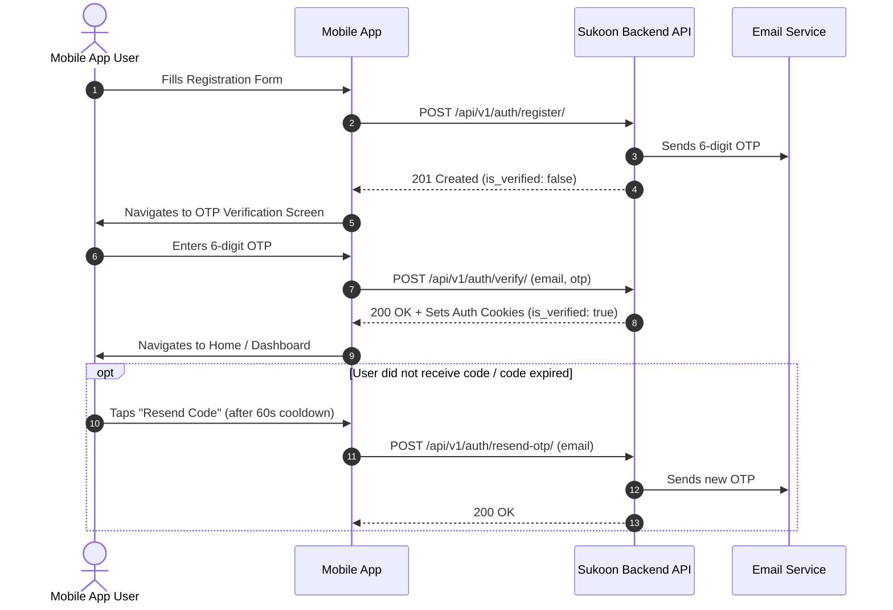

# Mobile Authentication: Email OTP Verification Guide

This document provides complete instructions for mobile developers (Flutter / React Native / iOS / Android) to implement the registration and email OTP verification flow in the Sukoon mobile app.

---

## 1. Flow Overview



---

## 2. API Endpoints

### Endpoint 1: Register User & Trigger OTP

Creates an account in unverified status (`is_verified: false`) and automatically generates and emails a 6-digit numeric OTP code.

- **HTTP Method**: `POST`
- **URL**: `/api/v1/auth/register/`
- **Authentication**: None (`AllowAny`)
- **Headers**:
  ```http
  Content-Type: application/json
  Accept: application/json
  ```

#### Request Payload
```json
{
  "first_name": "Zeyad",
  "last_name": "Salama",
  "email": "user@example.com",
  "password": "StrongPassword123!",
  "re_password": "StrongPassword123!",
  "birth_date": "1998-05-20",      // Optional (YYYY-MM-DD)
  "phone_number": "+201012345678"  // Optional
}
```

#### Success Response (`201 Created`)
```json
{
  "message": "Registration successful. A verification code has been sent to your email.",
  "data": {
    "user": {
      "id": "3fa85f64-5717-4562-b3fc-2c963f66afa6",
      "email": "user@example.com",
      "first_name": "Zeyad",
      "last_name": "Salama",
      "is_verified": false
    }
  }
}
```

#### Common Error Responses (`400 Bad Request`)
```json
// Email already exists
{
  "message": "Email: A user with this email already exists."
}

// Password mismatch
{
  "message": "Non Field Errors: The two password fields didn't match."
}

// Password too weak
{
  "message": "Password: This password is too short. It must contain at least 8 characters."
}
```

---

### Endpoint 2: Verify Email OTP

Validates the submitted 6-digit code against the cached OTP. On success, updates `user.is_verified = true`, invalidates the OTP, and establishes session cookies.

- **HTTP Method**: `POST`
- **URL**: `/api/v1/auth/verify/`
- **Aliases**: `/api/v1/auth/verify-email/`, `/api/v1/auth/verify-otp/`
- **Authentication**: None (`AllowAny`)
- **Headers**:
  ```http
  Content-Type: application/json
  Accept: application/json
  ```

#### Request Payload
```json
{
  "email": "user@example.com",
  "otp": "482910"
}
```

#### Success Response (`200 OK`)
> **Note**: The response sets the standard HTTP authentication cookies: `access`, `refresh`, and `logged_in=true`. Ensure your HTTP client (e.g. `Dio` in Flutter, `Axios` in React Native, or `URLSession`) stores and persists cookies.

```json
{
  "message": "Email verified successfully.",
  "data": {
    "user": {
      "id": "3fa85f64-5717-4562-b3fc-2c963f66afa6",
      "email": "user@example.com",
      "first_name": "Zeyad",
      "last_name": "Salama",
      "is_verified": true
    }
  }
}
```

#### Common Error Responses (`400 Bad Request`)
```json
// Incorrect code
{
  "message": "Otp: Invalid verification code."
}

// Expired or non-existent code (after 10 minutes)
{
  "message": "Otp: The verification code has expired or is invalid. Please request a new one."
}

// Brute-force lockout (exceeded 5 failed attempts)
{
  "message": "Otp: Too many failed attempts. Please request a new verification code."
}

// Invalid format
{
  "message": "Otp: Verification code must be 6 digits."
}
```

---

### Endpoint 3: Resend Verification OTP

Generates and delivers a fresh 6-digit OTP. Enforces a **60-second cooldown** between consecutive requests.

- **HTTP Method**: `POST`
- **URL**: `/api/v1/auth/resend-otp/`
- **Authentication**: None (`AllowAny`)
- **Headers**:
  ```http
  Content-Type: application/json
  Accept: application/json
  ```

#### Request Payload
```json
{
  "email": "user@example.com"
}
```

#### Success Response (`200 OK`)
```json
{
  "message": "A new verification code has been sent to your email.",
  "data": {}
}
```

#### Common Error Responses (`400 Bad Request`)
```json
// Cooldown still active
{
  "message": "Detail: Please wait before requesting another verification code."
}

// Account already verified
{
  "message": "Email: This email is already verified."
}

// User not found
{
  "message": "Email: User with this email does not exist."
}
```

---

## 3. UI/UX Recommendations for Mobile

1. **OTP Input Field**:
   - Use a 6-cell digit input component with numeric keypad (`keyboardType: TextInputType.number`).
   - Auto-submit when all 6 digits are typed.
   - Automatically paste codes from SMS / clipboard if supported.

2. **Expiration Countdown (10 Minutes)**:
   - Display a countdown timer (e.g. `Code expires in 09:59`).
   - When timer reaches `00:00`, show: *"Code expired. Please request a new code."* and disable the verify button until a new code is sent.

3. **Resend Button Cooldown (60 Seconds)**:
   - Disable the "Resend Code" button immediately upon screen entry or after tapping.
   - Display a 60-second cooldown timer: *"Resend code in 0:59"*.
   - Enable the button once the cooldown expires.

4. **Security & Cookie Persistence**:
   - The backend uses cookie-based authentication via `CookieAuthentication`.
   - Ensure the mobile networking library has a persistent cookie jar (e.g. `dio_cookie_manager` in Flutter, `react-native-cookies` in React Native, or `HTTPCookieStorage.shared` in iOS).
   - Upon receiving `200 OK` from `/api/v1/auth/verify/`, cookies are set and the user is authenticated; navigate directly to the application home screen without asking them to log in again.
