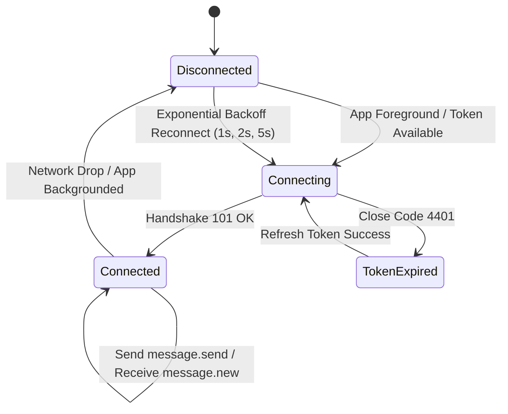

# Mobile Developer API Guide: Real-Time Chat & Direct Messaging

This document specifies the technical contract and integration guidelines for the **1:1 Real-Time Chat & Messaging** module in **Sukoon Mobile (iOS & Android)**.

---

## 1. Architecture Overview

Sukoon Chat uses a **hybrid WebSocket + REST architecture**:

1. **WebSocket (`ws://` / `wss://`)**:
   - Primary transport for sending messages and receiving live updates in real time with minimal latency.
   - Handles real-time message delivery (`message.new`) and read receipts (`message.read`).
   - Uses a **personal user group** (`chat_user_<user_uuid>`) so a single WebSocket connection handles all active conversations for that user.
2. **REST API (`http://` / `https://`)**:
   - Used for loading the paginated conversation list (`/api/v1/chat/conversations/`).
   - Used for retrieving message history when opening a chat room (`/api/v1/chat/conversations/{id}/messages/`).
   - Serves as a reliable HTTP fallback when the device is on a degraded network or reconnecting.
3. **Firebase Cloud Messaging (FCM)**:
   - When a user is in the background or killed state, incoming messages trigger a background FCM push notification (`new_message`) with sound and deep-linking data.

---

## 2. WebSocket Protocol (`/ws/chat/`)

### 2.1 Handshake & Authentication

Because mobile native WebSocket libraries and web browsers cannot send standard `Authorization: Bearer ...` headers on the initial WebSocket HTTP upgrade handshake, the JWT access token is passed as a **query-string parameter**.

- **URL**: `ws://<host>/ws/chat/?token=<JWT_ACCESS_TOKEN>`
  *(Production: `wss://sukoon-app-y4j5r.ondigitalocean.app/ws/chat/?token=<JWT_ACCESS_TOKEN>`)*
  *(Local dev: `ws://127.0.0.1:8000/ws/chat/?token=<JWT_ACCESS_TOKEN>`)*

#### Authentication & Lifecycle Rules:
- **Success**: Handshake succeeds with HTTP `101 Switching Protocols`. The user's connection automatically joins their personal channel group (`chat_user_<user_id>`).
- **Unauthenticated / Expired Token**: The handshake is rejected immediately with close code **`4401`** (or HTTP `403 Forbidden`). When receiving `4401`, refresh the access token via `/api/v1/auth/jwt/refresh/` and reconnect with the new token.
- **Presence**: When connected, the user is marked `is_online = true`. When disconnected, presence expires automatically.

---

### 2.2 Client-to-Server Events (Sending from App)

All frames sent over the socket MUST be JSON text strings with a `"type"` property.

#### A. Send Message (`message.send`)
Send this event when the user types a message and taps Send.

```json
{
  "type": "message.send",
  "conversation_id": "6df9c661-e2ba-4409-b7c5-b4b21eef11fb",
  "content": "مرحباً، هل العقار متاح للمعاينة يوم الجمعة؟"
}
```

| Field | Type | Required | Description |
| :--- | :--- | :--- | :--- |
| `type` | `string` | Yes | Must be `"message.send"` |
| `conversation_id` | `string (UUID)` | Yes | UUID of the active conversation |
| `content` | `string` | Yes | Plain text message (max 5000 characters) |

#### B. Mark Conversation as Read (`message.read`)
Send this event when the user opens the chat screen or views new incoming messages.

```json
{
  "type": "message.read",
  "conversation_id": "6df9c661-e2ba-4409-b7c5-b4b21eef11fb"
}
```

| Field | Type | Required | Description |
| :--- | :--- | :--- | :--- |
| `type` | `string` | Yes | Must be `"message.read"` |
| `conversation_id` | `string (UUID)` | Yes | UUID of the conversation being viewed |

---

### 2.3 Server-to-Client Events (Received by App)

Listen for inbound frames on the open socket:

#### A. New Message Received (`message.new`)
Pushed to **both** participants (the sender for UI confirmation and the recipient for real-time display).

```json
{
  "type": "message.new",
  "payload": {
    "id": "0ad61f24-43b8-42c1-ae60-2f069172d2ed",
    "conversation": 1,
    "sender": {
      "id": "a62fd707-be74-4957-97f9-ce8742c9a256",
      "first_name": "زياد",
      "last_name": "محمد",
      "full_name": "زياد محمد",
      "email": "user@example.com",
      "avatar_url": "https://res.cloudinary.com/...",
      "is_online": true
    },
    "content": "مرحباً، هل العقار متاح للمعاينة يوم الجمعة؟",
    "created_at": "2026-09-15T02:37:04.510415+03:00"
  }
}
```

#### B. Read Receipt Received (`message.read`)
Pushed to the other participant when their recipient reads the conversation.

```json
{
  "type": "message.read",
  "payload": {
    "conversation_id": "6df9c661-e2ba-4409-b7c5-b4b21eef11fb",
    "reader_id": "f9cf1cdf-50bc-4136-a042-2302ec1513b2"
  }
}
```

---

## 3. REST API Specification

### 3.1 List Conversations
Loads the conversations list screen, sorted by the most recent message.

* **Method**: `GET`
* **URL**: `/api/v1/chat/conversations/`
* **Auth**: Required (`IsAuthenticated`)
* **Query Params**:
  - `page`: Page number (default `1`)
  - `page_size`: Items per page (default `20`, max `100`)

**Response (`200 OK`):**
```json
{
  "data": {
    "count": 1,
    "next": null,
    "previous": null,
    "results": [
      {
        "id": "6df9c661-e2ba-4409-b7c5-b4b21eef11fb",
        "other_participant": {
          "id": "f9cf1cdf-50bc-4136-a042-2302ec1513b2",
          "first_name": "أحمد",
          "last_name": "عمارة",
          "full_name": "أحمد عمارة",
          "email": "owner@example.com",
          "avatar_url": "https://res.cloudinary.com/...",
          "is_online": true
        },
        "last_message_preview": "مرحباً، هل العقار متاح للمعاينة؟",
        "last_message_at": "2026-09-15T02:37:04.510415Z",
        "unread_count": 2,
        "updated_at": "2026-09-15T02:37:04.510415Z"
      }
    ]
  }
}
```

---

### 3.2 Create or Get Direct Conversation
Call this when the user taps "Message Owner" or "Chat" from a property details screen or user profile. This endpoint is **idempotent** — if a conversation already exists between the two users, it returns the existing one.

* **Method**: `POST`
* **URL**: `/api/v1/chat/conversations/create/`
* **Auth**: Required (`IsAuthenticated`)
* **Headers**: `Content-Type: application/json`

**Request Body:**
```json
{
  "user_id": "f9cf1cdf-50bc-4136-a042-2302ec1513b2"
}
```

**Response (`200 OK`):**
```json
{
  "message": "Operation successful.",
  "data": {
    "id": "6df9c661-e2ba-4409-b7c5-b4b21eef11fb",
    "other_participant": {
      "id": "f9cf1cdf-50bc-4136-a042-2302ec1513b2",
      "first_name": "أحمد",
      "last_name": "عمارة",
      "full_name": "أحمد عمارة",
      "email": "owner@example.com",
      "avatar_url": "https://res.cloudinary.com/...",
      "is_online": false
    },
    "last_message_preview": "",
    "last_message_at": null,
    "unread_count": 0,
    "updated_at": "2026-09-15T02:30:00Z"
  }
}
```

---

### 3.3 Get Message History
Fetches historical messages for a conversation, ordered chronologically (**oldest first**).

* **Method**: `GET`
* **URL**: `/api/v1/chat/conversations/{id}/messages/`
* **Auth**: Required (`IsAuthenticated` + `IsParticipant`)
* **Query Params**:
  - `page`: Page number (default `1`)
  - `page_size`: Messages per page (default `50`, max `200`)

**Response (`200 OK`):**
```json
{
  "data": {
    "count": 2,
    "next": null,
    "previous": null,
    "results": [
      {
        "id": "0ad61f24-43b8-42c1-ae60-2f069172d2ed",
        "conversation": 1,
        "sender": {
          "id": "a62fd707-be74-4957-97f9-ce8742c9a256",
          "first_name": "زياد",
          "last_name": "محمد",
          "full_name": "زياد محمد",
          "email": "user@example.com",
          "avatar_url": "",
          "is_online": true
        },
        "content": "السلام عليكم، هل الشقة ما زالت متوفرة؟",
        "created_at": "2026-09-15T02:35:00Z"
      },
      {
        "id": "1bd72e35-54c9-53d2-bf71-3f170283e3fe",
        "conversation": 1,
        "sender": {
          "id": "f9cf1cdf-50bc-4136-a042-2302ec1513b2",
          "first_name": "أحمد",
          "last_name": "عمارة",
          "full_name": "أحمد عمارة",
          "email": "owner@example.com",
          "avatar_url": "https://res.cloudinary.com/...",
          "is_online": true
        },
        "content": "وعليكم السلام، نعم متوفرة، يمكنك حجز موعد معاينة.",
        "created_at": "2026-09-15T02:36:10Z"
      }
    ]
  }
}
```

---

### 3.4 Send Message (REST Fallback)
HTTP fallback to send a message when WebSockets are disconnected or reconnecting.

* **Method**: `POST`
* **URL**: `/api/v1/chat/conversations/{id}/messages/create/`
* **Auth**: Required (`IsAuthenticated` + `IsParticipant`)
* **Headers**: `Content-Type: application/json`

**Request Body:**
```json
{
  "content": "شكراً جزيلاً، سأقوم بحجز المعاينة الآن."
}
```

**Response (`201 Created`):**
```json
{
  "message": "Created successfully.",
  "data": {
    "id": "3ce83f46-65da-64e3-cf82-4f281394f4ff",
    "conversation": 1,
    "sender": {
      "id": "a62fd707-be74-4957-97f9-ce8742c9a256",
      "first_name": "زياد",
      "last_name": "محمد",
      "full_name": "زياد محمد",
      "email": "user@example.com",
      "avatar_url": "",
      "is_online": true
    },
    "content": "شكراً جزيلاً، سأقوم بحجز المعاينة الآن.",
    "created_at": "2026-09-15T02:38:00Z"
  }
}
```

---

### 3.5 Mark Conversation as Read
Marks all unread messages in the conversation as read for the requesting user, resets `unread_count` to 0, and dispatches a read receipt to the other participant.

* **Method**: `POST`
* **URL**: `/api/v1/chat/conversations/{id}/read/`
* **Auth**: Required (`IsAuthenticated` + `IsParticipant`)

**Response (`200 OK`):**
```json
{
  "message": "Operation successful.",
  "data": {
    "status": "read"
  }
}
```

---

## 4. Firebase Cloud Messaging (FCM) Push Delivery

When an incoming message arrives and the recipient does not have an active chat screen open, the backend triggers an FCM high-priority push notification.

### Push Payload Structure

```json
{
  "notification": {
    "title": "New message from أحمد عمارة",
    "body": "مرحباً، هل العقار متاح للمعاينة؟"
  },
  "data": {
    "notification_type": "new_message",
    "category": "chat",
    "conversation_id": "6df9c661-e2ba-4409-b7c5-b4b21eef11fb",
    "message_id": "0ad61f24-43b8-42c1-ae60-2f069172d2ed",
    "sender_id": "f9cf1cdf-50bc-4136-a042-2302ec1513b2",
    "click_action": "FLUTTER_NOTIFICATION_CLICK"
  }
}
```

#### Mobile Deep-Linking Action:
On notification tap:
1. Extract `data.conversation_id`.
2. Navigate directly to the Chat Room screen: `ChatRoomScreen(conversationId: data.conversation_id)`.
3. Call `POST /api/v1/chat/conversations/{id}/read/` (or send `{"type": "message.read", "conversation_id": "..."}`) to clear the unread counter badge.

---

## 5. Recommended Mobile Implementation Strategy

### Flutter / React Native / Native Swift & Kotlin State Machine



1. **Lifecycle Awareness**:
   - Establish the socket connection when the user logs in and the app enters the foreground.
   - When entering the background, gracefully close the socket to save battery and bandwidth. Incoming messages will be delivered via FCM push.
2. **Reconnection with Exponential Backoff**:
   - If the connection drops unexpectedly, retry connecting after 1s, 2s, 4s, up to 10s max.
3. **Local Optimistic UI**:
   - When the user taps send, display the message immediately in the chat bubble with a pending icon (clock/spinner).
   - Once the server responds with `message.new` over the socket, update the status to sent (check mark).
   - If the socket fails after timeout, fall back to `POST /api/v1/chat/conversations/{id}/messages/create/`.
4. **Unread Counter Badge**:
   - The total unread badge on the Bottom Navigation Bar equals the sum of `unread_count` across all conversation list items.
   - Increment locally when `message.new` arrives for a conversation not currently open.
